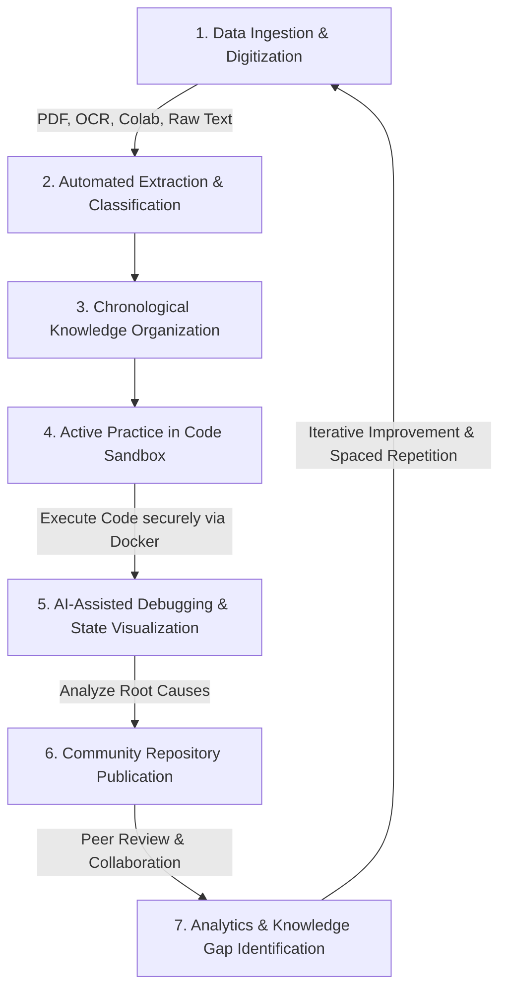

# LearnLoop: Daily Learning Brain & Placement Preparation Platform
**Version 1**

---

## 1. Executive Summary

LearnLoop is an enterprise-grade, desktop-optimized interactive workspace architected specifically for students undergoing Campus Recruitment Training (CRT) and rigorous technical placement preparation. Operating as an external digital brain, LearnLoop systematically mitigates the cognitive overload associated with technical interviews by offering a unified ecosystem to capture knowledge, practice programming, visually trace code execution, and engage in collaborative cohort-based learning.

Our mission is to bridge the gap between passive learning (watching tutorials, taking static notes) and active mastery (writing optimized code, understanding system memory, and passing technical interviews).

---

## 2. Core Value Proposition

Preparing for competitive engineering placements requires managing a vast corpus of algorithms, data structures, and system design concepts. LearnLoop resolves this fragmentation by centralizing the learning lifecycle into a structured, high-retention environment.

### 2.1. Mitigating Information Decay
Without structure, students forget 70% of what they learn within a week. LearnLoop uses chronological tagging and spaced-repetition prompts to ensure concepts from Day 1 are actively recalled on Day 40.

### 2.2. Closing the Execution Gap
Reading code is entirely different from writing it under pressure. By integrating a live sandbox environment directly within the study materials, LearnLoop forces active participation, accelerating the transition from theory to practical application.

---

## 3. Detailed Target Audience & Personas

LearnLoop is designed to serve a diverse spectrum of academic profiles:

* **The Coding Novice:** A student who struggles with syntax and basic logic. They benefit from our *AI Explainer* and visual execution environments that demystify how loops and variables operate in real-time.
* **The CRT Candidate:** A pre-final year student undergoing intensive algorithmic training. They rely heavily on the *Chronological Organization* and *Cohort Community* to manage the immense daily volume of assignments.
* **The Interview Prepper:** A final-year student fine-tuning their skills for FAANG-level interviews. They utilize the *Performance Telemetry* and advanced *Call Stack Visualization* for dynamic programming and graph algorithms.

---

## 4. Feature Deep-Dive & Capabilities

### 4.1. Structured Daily Tracking & Accountability
* **Chronological Learning Journeys:** Categorizes all lecture notes, code snippets, and study materials into a day-by-day timeline (e.g., Day 1: Arrays, Day 2: Pointers).
* **Metrics-Driven Motivation:** Visual activity streaks and quantitative daily trackers establish accountability. 

### 4.2. Instant Conceptual Clarity via Artificial Intelligence
* **Algorithmic Demystification:** Users can interface with our AI to receive structured, pedagogical breakdowns. If a student highlights a `QuickSort` block, the AI explains the pivot selection and partitioning logic.
* **Automated Error Diagnostics:** During active practice, any compilation or runtime failures (e.g., `Segmentation Fault`, `IndexError`) are intercepted. The platform analyzes the root cause and synthesizes heavily annotated code solutions.

### 4.3. Visual Code Execution & Sandbox Environments
* **Zero-Configuration Workspaces:** Students can author, compile, and execute Python, C, C++, and Java natively within the browser via secure containerized execution environments.
* **State & Execution Visualization:** LearnLoop provides real-time visualization of execution flows. Users can explicitly trace variable state mutations, loop iterations, and call stack expansions.

### 4.4. Zero-Friction Knowledge Digitization
* **Optical Character Recognition (OCR):** Upload imagery of handwritten ledgers or physical whiteboards. The system employs advanced OCR to extract, format, and persist the text.
* **Seamless Document Parsing:** Upload extensive PDFs or provide Google Colab URLs; the platform automatically parses the content into digestible study cards and executable code blocks.

### 4.5. Cohort-Based Collaborative Synergies
* **Community-Driven Knowledge Sharing:** Students seamlessly publish curated notes, optimal solutions, and conceptual explanations to a batch-wide repository.
* **Peer-to-Peer Review:** Cohort members annotate, interrogate, and propose alternative optimizations to shared resources.

---

## 5. System Architecture & Technical Workflow

The platform operates via a continuous, closed-loop workflow that shepherds students from the initial ingestion of raw data through active application and community collaboration.

---

## 6. Technology Stack & Implementation Framework

To achieve an enterprise-grade experience, LearnLoop is built on a highly scalable, modern technology stack:

### 6.1. Frontend Architecture
* **Framework:** React.js / Next.js for server-side rendering and rapid client-side hydration.
* **Styling:** TailwindCSS and Framer Motion for complex micro-animations and responsive grid layouts.
* **State Management:** Redux Toolkit or Zustand for managing complex user workflows, sandbox states, and dashboard updates.

### 6.2. Backend & API Layer
* **Core Server:** Node.js with Express.js (or Python/FastAPI) to handle asynchronous requests and complex data transformations.
* **Code Execution Engine:** Secure, ephemeral Docker containers configured to execute untrusted code (Python/C) with strict memory, network, and timeout constraints.

### 6.3. Database & Storage
* **Primary Database:** PostgreSQL for relational data (users, cohorts, posts, streaks).
* **Document Store:** MongoDB or Firebase for storing unstructured data like raw extracted text, JSON code blocks, and dynamic AI explanations.
* **Blob Storage:** AWS S3 or Google Cloud Storage for hosting raw images, PDFs, and user avatars.

### 6.4. Artificial Intelligence Subsystems
* **Extraction:** Specialized OCR pipelines (e.g., Tesseract or Google Cloud Vision).
* **Inference:** Integration with OpenAI (GPT-4) or Anthropic (Claude 3) APIs to power the *AI Explainer* and *Error Diagnostics* engines, using custom system prompts tailored for computer science pedagogy.

---

## 7. Security & Compliance Protocols

Given the educational context and the execution of arbitrary user code, LearnLoop prioritizes security:
* **Sandboxing:** All user-submitted code is executed in isolated, non-privileged Docker containers without internet access to prevent malicious network activity.
* **Resource Quotas:** Execution environments enforce strict limits on CPU time, RAM usage, and output size to prevent DDoS or infinite loop exploits.
* **Data Privacy:** All user data, notes, and metrics are encrypted at rest (AES-256) and in transit (TLS 1.3), fully compliant with modern data protection standards.

---

## 8. Future Roadmap (Beyond Version 1)

As LearnLoop scales, the platform will expand to include:
* **V1.5 (Mock Interviews):** Integrated peer-to-peer technical mock interview rooms with shared whiteboards and real-time code collaboration.
* **V2.0 (Company-Specific Paths):** Dedicated modules dynamically structured to mimic the interview patterns of top-tier companies (e.g., Amazon, Microsoft, TCS, Infosys).
* **V2.5 (Recruiter Portal):** A specialized dashboard for university placement cells to track aggregate cohort performance and identify at-risk students.
* **V3.0 (Advanced Visualizations):** Expanding our 3D engine to support full, interactive VR/AR walkthroughs of complex system design architectures.
* **V3.5 (Automated Groq Scaling):** Dynamically scaling beyond the current 4-model Groq architecture to support custom-trained, institution-specific LLMs based on historical student data.

---

## 9. Getting Started

1. **Account Creation:** Sign up using a university email to automatically join your batch/cohort.
2. **Setup Your Timeline:** Input your current training day (e.g., Day 1) to initialize your chronological feed.
3. **Upload Your First Note:** Paste code or upload an image of a whiteboard from your last lecture.
4. **Run Code:** Click on the generated code snippet to open the sandbox and execute it immediately!

---

## 10. Current Implementation Details (Version 1)

This section provides an overview of the current codebase structure and active technologies deployed in the repository.

### 10.1. Technology Stack in Use
- **Frontend Core:** React 19, Vite, React Router DOM v7
- **Styling & UI:** TailwindCSS v4, Framer Motion, GSAP (for advanced animations), Lucide React (icons)
- **3D Rendering:** React Three Fiber, Three.js, React Three Drei
- **Editors & Syntax:** Monaco Editor, React Simple Code Editor, PrismJS
- **Backend/BaaS:** Firebase (Auth, Database integrations). Firebase is also utilized to save user-specific animations and UI state to persist the visually stunning experience across sessions.
- **AI Integration:** Google GenAI SDK, Groq API (via `groqService.js`). The platform utilizes **4 distinct Groq models concurrently** to manage heavy analytical loads, ensuring real-time AI responses and robust load balancing.
- **Server:** Node.js/Express proxy backend for API routing (`server/index.js`) using Axios and CORS.
- **Misc:** PDF.js for document parsing, Recharts for analytics data visualization.

### 10.2. Repository Structure
- `/src/components/`: Reusable UI elements, including complex components like `InteractiveAiExplanation.jsx`, `Header.jsx`, `Sidebar.jsx`, and `ThreeBackground.jsx`.
- `/src/pages/`: Core application routes.
  - `/AI/`: AI Explainer interfaces.
  - `/Auth/`: Authentication screens.
  - `/Community/`: Peer collaboration and cohort forums.
  - `/Dashboard/`: Main user workspace and metric tracking.
  - `/Notebook/`: Note-taking, timeline tracking, and active learning space.
  - `/Admin/`: Administrator dashboard capabilities.
- `/src/services/`: API and logic abstractions (`communityService.js`, `groqService.js`, `notebookService.js`).
- `/server/`: Express backend proxy server for handling external API communications (like code execution or proxying AI requests safely).

---

## 11. Core Examples & Specialized Capabilities

To better illustrate how LearnLoop operates in real-time, here are some key usage examples and standout features:

### 11.1. Real-time AI Explanation Example
**Scenario:** A student is struggling to understand a complex dynamic programming solution.
**Action:** The student highlights the DP array initialization code in the editor.
**Result:** The multi-model Groq architecture instantly processes the code snippet, returning a visually formatted, step-by-step breakdown of how the memory state changes, rendered beautifully with Framer Motion animations.

### 11.2. Visually Stunning UI & Persistence
LearnLoop goes beyond standard study tools by providing a highly engaging, gamified user interface:
- **3D Interactive Environments:** Using React Three Fiber and GSAP, the platform renders a "brain-like" 3D node network that visualizes the student's learning progress.
- **Persistent Animations:** Custom GSAP and Framer Motion animation states are actively saved to **Firebase**. When a user logs back in, their visual dashboard reconstructs itself seamlessly, maintaining the beautiful visuals and immersive experience without losing their place.

### 11.3. Robust Load Balancing Strategy
By distributing AI workloads across **4 specialized Groq instances**, the platform can simultaneously handle:
1. Syntax error correction.
2. Conceptual pedagogical explanations.
3. Code optimization suggestions.
4. General conversational Q&A.
This ensures zero bottlenecking during peak usage hours when an entire cohort is practicing simultaneously.
